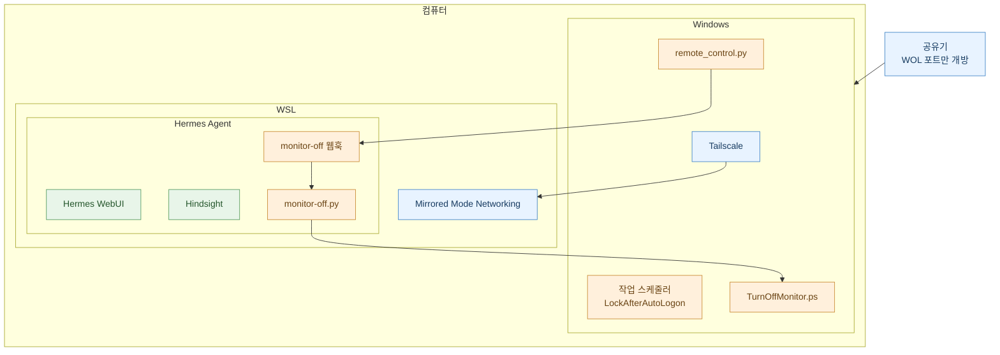

```mermaid
flowchart TB
    Router["공유기<br/>WOL 포트만 개방"]

    subgraph Computer["컴퓨터"]
        subgraph Windows["Windows"]
            TS["Tailscale"]
            RC["remote_control.py"]
            Task["작업 스케줄러<br/>LockAfterAutoLogon"]
            Monitor["TurnOffMonitor.ps"]
        end

        subgraph WSL["WSL"]
            Net["Mirrored Mode Networking"]

            subgraph Hermes["Hermes Agent"]
                WebUI["Hermes WebUI"]
                Hindsight["Hindsight"]
                Webhook["monitor-off 웹훅"]
                Script["monitor-off.py"]
            end
        end
    end

    Router --> Windows
    TS --> Net
    RC --> Webhook
    Webhook --> Script
    Script --> Monitor

    classDef network fill:#e8f3ff,stroke:#4385c6,color:#173b60
    classDef automation fill:#fff0dc,stroke:#c98b35,color:#694313
    classDef service fill:#e8f5e9,stroke:#579b61,color:#24552b

    class Router,TS,Net network
    class RC,Task,Monitor,Webhook,Script automation
    class WebUI,Hindsight service
```
